# Agent-SRE Architecture

> SRE toolkit for AI agent reliability — SLO management, error budgets, chaos engineering, progressive delivery, cost guardrails, incident management, and observability.

## 1. Overview

Agent-SRE brings Site Reliability Engineering practices to autonomous AI agents. It provides seven core engines that work together to define, measure, and enforce reliability for agent operations — from SLO tracking and error budgets through chaos testing, progressive delivery, cost guardrails, incident management, and observability.

```mermaid
graph TB
    subgraph "Agent-SRE Core"
        SLO["SLO Engine<br/><code>slo/</code>"]
        CHAOS["Chaos Engine<br/><code>chaos/</code>"]
        REPLAY["Replay Engine<br/><code>replay/</code>"]
        COST["Cost Guard<br/><code>cost/</code>"]
        DELIVERY["Progressive Delivery<br/><code>delivery/</code>"]
        INCIDENTS["Incident Manager<br/><code>incidents/</code>"]
        ALERTS["Alert System<br/><code>alerts/</code>"]
    end

    subgraph "Observability Layer"
        TRACING["OTel Tracing<br/><code>tracing/</code>"]
        ADAPTERS["Framework Adapters<br/><code>adapters/</code>"]
        INTEGRATIONS["Platform Integrations<br/><code>integrations/</code>"]
    end

    subgraph "External Systems"
        AGENT_OS["Agent-OS<br/>(Governance Kernel)"]
        AGENT_MESH["Agent-Mesh<br/>(Trust & Identity)"]
        PLATFORMS["Datadog · Langfuse · Arize<br/>Prometheus · MLflow · W&B"]
    end

    SLO --> ALERTS
    SLO --> INCIDENTS
    COST --> ALERTS
    CHAOS --> REPLAY
    REPLAY --> DELIVERY
    INCIDENTS --> DELIVERY
    ADAPTERS --> SLO
    TRACING --> INTEGRATIONS
    INTEGRATIONS --> PLATFORMS
    INTEGRATIONS --> AGENT_OS
    INTEGRATIONS --> AGENT_MESH
```

## 2. Engine Architecture

### SLO Engine (`src/agent_sre/slo/`)

Defines what "reliable" means for an agent using Service Level Indicators (SLIs) and Service Level Objectives (SLOs).

| Component | File | Purpose |
|-----------|------|---------|
| `SLI` (abstract) | `indicators.py` | Base class for all indicators — `collect()`, `record()`, `current_value()`, `compliance()` |
| Built-in SLIs | `indicators.py` | `TaskSuccessRate`, `ToolCallAccuracy`, `ResponseLatency`, `CostPerTask`, `PolicyCompliance`, `DelegationChainDepth`, `HallucinationRate` |
| `SLO` | `objectives.py` | Combines SLIs with error budgets; `evaluate()` triggers alerts on breach |
| `ErrorBudget` | `objectives.py` | Burn rate calculation across time windows (1h, 6h, 24h, 7d, 30d) |
| `SLIRegistry` | `indicators.py` | Discovers and manages SLI types per agent |

### Chaos Engine (`src/agent_sre/chaos/`)

Fault injection and resilience testing for agents.

| Component | File | Purpose |
|-----------|------|---------|
| `ChaosExperiment` | `engine.py` | Run experiments — `start()`, `inject_fault()`, `check_abort()`, `calculate_resilience()` |
| `Fault` | `engine.py` | Fault descriptors with static builders (e.g. `tool_timeout()`, `llm_latency()`, `cost_spike()`) |
| `AbortCondition` | `engine.py` | Safety thresholds to halt experiments |
| `ResilienceScore` | `engine.py` | Results: overall, fault_tolerance, recovery_time_ms, degradation_percent |
| `ChaosLibrary` | `library.py` | Pre-built templates: tool-timeout, tool-error-storm, llm-latency-spike, cascading-failure, etc. |

### Replay Engine (`src/agent_sre/replay/`)

Capture, store, and deterministically replay agent execution traces.

| Component | File | Purpose |
|-----------|------|---------|
| `Trace` / `Span` | `capture.py` | Execution recording — spans have `SpanKind` (AGENT_TASK, TOOL_CALL, LLM_INFERENCE, DELEGATION, POLICY_CHECK) |
| `TraceCapture` | `capture.py` | Context manager for live capture — `start_span()`, `end_span()` |
| `TraceStore` | `capture.py` | Persistent JSON storage — `save()`, `load()`, `list_traces()` |
| `ReplayEngine` | `engine.py` | Deterministic replay with diffing — `replay()`, `diff()`, `what_if()` |
| `TraceDiff` | `engine.py` | Compares output, cost, latency, tool sequence, and spans between runs |
| Distributed replay | `distributed.py` | Cross-agent trace replay |
| Visualization | `visualization.py` | Trace rendering |

### Cost Guard (`src/agent_sre/cost/`)

Token/API cost tracking and budget enforcement.

| Component | File | Purpose |
|-----------|------|---------|
| `CostGuard` | `guard.py` | Per-task / per-agent / org budget enforcement — throttle at 85%, kill at 95% |
| `AgentBudget` | `guard.py` | Per-agent budget state: `remaining_today_usd`, `utilization_percent` |
| `CostAnomalyDetector` | `anomaly.py` | ML-based detection via Z-score, IQR, and EWMA methods |

### Progressive Delivery (`src/agent_sre/delivery/`)

Canary deployments, shadow testing, and A/B testing for agent versions.

| Component | File | Purpose |
|-----------|------|---------|
| `CanaryRollout` | `rollout.py` | Progressive traffic shifting — `advance()`, `rollback()`, `promote()` |
| `ShadowMode` | `rollout.py` | Shadow testing — `compare()`, `is_passing()`, `finish()` |
| `RolloutStep` | `rollout.py` | Single step: weight (0–1), duration, analysis criteria, manual gate |
| `RolloutSpec` | `gitops.py` | GitOps declarative spec (YAML) — `default_canary()`, `default_shadow()` |

### Incident Manager (`src/agent_sre/incidents/`)

Automated incident detection, classification, circuit breakers, and postmortems.

| Component | File | Purpose |
|-----------|------|---------|
| `IncidentDetector` | `detector.py` | Correlates signals into incidents with dedup and correlation windows |
| `Incident` | `detector.py` | Lifecycle: `acknowledge()` → `investigate()` → `mitigate()` → `resolve()` |
| `Signal` | `detector.py` | Signal types: SLO_BREACH, ERROR_BUDGET_EXHAUSTED, COST_ANOMALY, POLICY_VIOLATION |
| `CircuitBreaker` | `circuit_breaker.py` | States: CLOSED → OPEN → HALF_OPEN; auto-isolates failing agents |
| `CircuitBreakerRegistry` | `circuit_breaker.py` | Manages breakers per agent |
| `PostmortemGenerator` | `postmortem.py` | Generates timeline, action items, lessons learned; `to_markdown()` |

### Alert System (`src/agent_sre/alerts/`)

Alert management, deduplication, batching, and multi-channel routing.

| Component | File | Purpose |
|-----------|------|---------|
| `AlertManager` | `__init__.py` | Central dispatcher — `send()` to channels with severity filtering |
| `AlertDeduplicator` | `dedup.py` | Thread-safe duplicate suppression within configurable time window |
| `AlertBatcher` | `dedup.py` | Batch alerts into digests — `add()`, `flush()`, `get_digest()` |
| Channels | `__init__.py` | Slack, PagerDuty, OpsGenie, Teams, webhooks, callbacks |

## 3. SRE Engine Interaction Flow

The engines form a closed-loop reliability system. SLO breaches trigger alerts, which feed incident detection, which drives chaos experiments for validation, replay for root-cause analysis, and circuit breakers for containment.

### Detailed Signal Flow

## 4. Replay & Delivery Pipeline

The replay engine captures execution traces and compares them across runs. The delivery engine uses these diffs to make safe rollout decisions.

```mermaid
flowchart TB
    subgraph Capture
        A1["TraceCapture<br/>(context manager)"] -->|start_span / end_span| A2["Trace + Spans"]
        A2 --> A3["TraceStore<br/>(JSON persistence)"]
    end

    subgraph "Replay & Diff"
        A3 --> B1["ReplayEngine.load()"]
        B1 --> B2["replay()<br/>deterministic re-execution"]
        B2 --> B3["diff()"]
        B3 --> B4["TraceDiff"]
        B4 --> B5["Compare:<br/>output · cost · latency<br/>tool sequence · spans"]
    end

    subgraph "what_if Analysis"
        B1 --> C1["what_if()<br/>modified replay"]
        C1 --> B3
    end

    subgraph Delivery
        B5 --> D1{"Diff within<br/>tolerance?"}
        D1 -->|yes| D2["CanaryRollout.advance()"]
        D1 -->|no| D3["CanaryRollout.rollback()"]
        D2 --> D4["ShadowMode.compare()"]
        D4 --> D5{"Shadow<br/>passing?"}
        D5 -->|yes| D6["promote()"]
        D5 -->|no| D3
    end

    style D6 fill:#4CAF50,color:#fff
    style D3 fill:#f44336,color:#fff
```

### Rollout Progression

```mermaid
stateDiagram-v2
    [*] --> Pending
    Pending --> InProgress : start()
    InProgress --> Paused : pause()
    Paused --> InProgress : resume()
    InProgress --> InProgress : advance() (next step)
    InProgress --> RolledBack : rollback()
    InProgress --> Promoted : promote()
    RolledBack --> [*]
    Promoted --> [*]

    note right of InProgress
        Each step has:
        - weight (0–1 traffic %)
        - duration_seconds
        - analysis criteria
        - optional manual gate
    end note
```

## 5. Chaos Engineering Model

The chaos engine validates agent resilience through controlled fault injection with safety abort conditions.

### Pre-built Chaos Templates (`ChaosLibrary`)

| Template | Fault Type | Purpose |
|----------|-----------|---------|
| `tool-timeout` | Tool timeout | Validate timeout handling |
| `tool-error-storm` | Tool errors | Test error recovery at scale |
| `tool-schema-drift` | Schema mismatch | Validate schema evolution handling |
| `llm-latency-spike` | LLM latency | Test degraded inference performance |
| `llm-quality-degradation` | LLM quality | Test with lower-quality responses |
| `delegation-rejection` | Delegation reject | Test multi-agent failure isolation |
| `credential-expiry` | Credential expire | Validate credential rotation |
| `network-partition` | Network partition | Test network failure recovery |
| `cost-explosion` | Cost spike | Validate cost guard enforcement |
| `cascading-failure` | Multi-fault | Test resilience under compound failures |

## 6. Cost Guard Budget Lifecycle

The cost guard tracks spending at task, agent, and organization levels with automatic throttling and kill-switch enforcement.

```mermaid
flowchart TB
    subgraph "Budget Allocation"
        A1["Per-task limit<br/>(max USD per task)"] --> B1["CostGuard"]
        A2["Per-agent daily limit"] --> B1
        A3["Org monthly budget"] --> B1
    end

    subgraph "Tracking"
        B1 --> C1["check_task()"]
        C1 --> C2["record_cost()"]
        C2 --> C3["AgentBudget<br/>remaining_today_usd<br/>utilization_percent<br/>avg_cost_per_task"]
    end

    subgraph "Anomaly Detection"
        C2 --> D1["CostAnomalyDetector"]
        D1 --> D2["Z-score"]
        D1 --> D3["IQR"]
        D1 --> D4["EWMA"]
        D2 & D3 & D4 --> D5["AnomalyResult<br/>severity + expected range"]
    end

    subgraph "Enforcement"
        C3 --> E1{"utilization %?"}
        E1 -->|"< 85%"| E2["✅ ALLOW"]
        E1 -->|"85–95%"| E3["⚠️ THROTTLE"]
        E1 -->|"> 95%"| E4["🛑 KILL"]
        D5 -->|anomaly detected| E5["CostAlert → AlertManager"]
        E4 --> E6["Circuit Breaker<br/>force_open()"]
    end

    style E2 fill:#4CAF50,color:#fff
    style E3 fill:#FF9800,color:#fff
    style E4 fill:#f44336,color:#fff
```

```mermaid
stateDiagram-v2
    [*] --> Normal : budget allocated
    Normal --> Warning : utilization ≥ 85%
    Warning --> Throttled : THROTTLE action
    Throttled --> Killed : utilization ≥ 95%
    Killed --> CircuitOpen : KILL action
    Normal --> Anomaly : anomaly detected
    Anomaly --> Warning
    CircuitOpen --> [*] : reset_daily()

    note right of Throttled
        Requests are rate-limited
        but not blocked
    end note
```

## 7. Integration & Exporter Architecture

### OpenTelemetry Tracing (`src/agent_sre/tracing/`)

Agent-SRE defines custom OTel semantic conventions for AI agent observability.

**Semantic Attributes** (`conventions.py`):
- `agent.did` — Decentralized identifier
- `agent.task.name`, `agent.task.success` — Task metadata
- `agent.tool.name` — Tool call identification
- `agent.model.name` — LLM model used
- `agent.delegation.from`, `agent.delegation.to` — Delegation chain
- `agent.trust_score` — Trust score from Agent-Mesh
- `agent.policy.name` — Policy check from Agent-OS

**Span Kinds** (`spans.py`): `AGENT_TASK`, `TOOL_CALL`, `LLM_INFERENCE`, `DELEGATION`, `POLICY_CHECK`

**Exporters** (`exporters.py`): OTLP gRPC, OTLP HTTP, Console

### Framework Adapters (`src/agent_sre/adapters/`)

Duck-typed adapters that instrument agent frameworks without requiring SDK imports.

```mermaid
flowchart LR
    subgraph "Agent Frameworks"
        LG["LangGraph"]
        CA["CrewAI"]
        AG["AutoGen"]
        OA["OpenAI Agents"]
        SK["Semantic Kernel"]
        DI["Dify"]
    end

    subgraph "Adapter Layer"
        BA["BaseAdapter<br/>_start_task() · _finish_task()<br/>get_sli_snapshot()"]
    end

    subgraph "SRE Engines"
        SLI["SLIs<br/>(success rate, cost, latency)"]
        CR["CostRecord"]
    end

    LG & CA & AG & OA & SK & DI --> BA
    BA --> SLI
    BA --> CR
```

### Platform Integrations (`src/agent_sre/integrations/`)

Export telemetry and metrics to external observability platforms.

## 8. Cross-Repo Ecosystem

Agent-SRE is one of three core repositories in the agent reliability ecosystem.

### Integration Points

| Direction | From → To | Data | Mechanism |
|-----------|-----------|------|-----------|
| **OS → SRE** | Policy Engine → SLO Engine | Policy compliance events | `POLICY_CHECK` spans, `PolicyCompliance` SLI |
| **OS → SRE** | Trust Framework → SLO Engine | Trust score updates | `agent.trust_score` OTel attribute |
| **OS → SRE** | Audit Logger → Replay Engine | Audit trail | Trace correlation |
| **Mesh → SRE** | Trust Scores → SLO Engine | Per-agent trust | `agent.trust_score` attribute |
| **Mesh → SRE** | Identity → Incident Manager | Agent DIDs | `agent.did` for incident correlation |
| **Mesh → SRE** | Delegation → Replay Engine | Delegation traces | `DELEGATION` span kind |
| **Mesh → SRE** | Delegation → Chaos Engine | Delegation faults | `delegation_reject()` fault type |
| **SRE → OS** | SLO Engine → Policy Engine | SLO compliance signals | Integration callback |
| **SRE → OS** | Cost Guard → Policy Engine | Budget status | Cost alert events |
| **SRE → Mesh** | Circuit Breaker → Delegation | Agent isolation | `force_open()` on breaker |
| **SRE → Mesh** | Progressive Delivery → Discovery | Rollout status | Canary weight updates |
